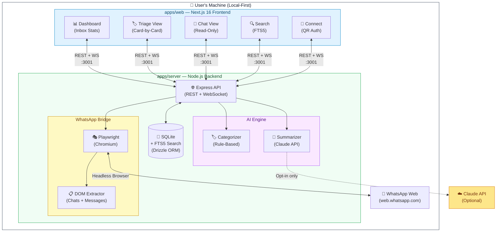
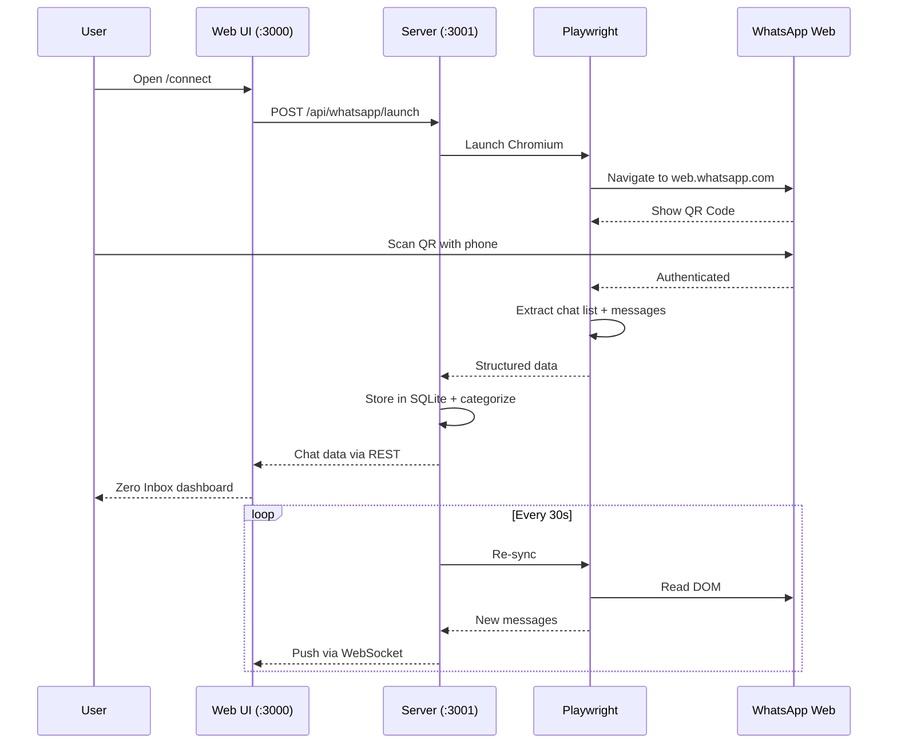

# SuperWA — Zero Inbox for WhatsApp

A local-first productivity super client for WhatsApp power users. Built on the principle of **zero inbox** — triage, categorize, summarize, snooze, and search your WhatsApp messages like a pro.

## Why

In countries like India, WhatsApp is the primary communication platform — replacing email, CRM, and even identity verification. Yet the official client offers zero productivity tools. SuperWA fills that gap.

## Features

- **Smart Triage** — Auto-categorize chats (personal, business, groups, channels, spam) and process them card-by-card
- **AI Summarization** — One-click summaries of group chats with action item extraction (powered by Claude API)
- **Snooze & Remind** — Temporarily hide conversations and resurface them later
- **Full-Text Search** — Search across all synced messages with SQLite FTS5
- **Zero Inbox View** — Process your inbox to zero, one chat at a time

## Architecture



### Data Flow



### Tech Stack

| Layer | Technology |
|-------|-----------|
| **Frontend** | Next.js 16, Tailwind CSS v4, TypeScript |
| **Backend** | Node.js, Express, WebSocket |
| **Browser Automation** | Playwright (Chromium) |
| **Database** | SQLite + Drizzle ORM + FTS5 |
| **AI** | Claude API (optional) |
| **Monorepo** | Turborepo + pnpm workspaces |

Everything runs locally on your machine. No messages leave your device (except opt-in Claude API calls for AI features).

## Project Structure

```
SuperWA/
├── apps/
│   ├── web/          # Next.js frontend
│   └── server/       # Node.js backend
├── packages/
│   └── shared/       # Shared TypeScript types
├── turbo.json
└── package.json
```

## Getting Started

### Prerequisites

- Node.js 20.9+
- pnpm 10+

### Install

```bash
git clone https://github.com/prakashwagle/SuperWA.git
cd SuperWA
pnpm install
```

### Run

```bash
# Terminal 1: Start backend
pnpm dev:server

# Terminal 2: Start frontend
pnpm dev:web
```

Then open [http://localhost:3000/connect](http://localhost:3000/connect) to link your WhatsApp account by scanning the QR code.

### AI Features (Optional)

Set your Anthropic API key to enable AI-powered summarization:

```bash
export ANTHROPIC_API_KEY=your-key-here
```

## Usage Guide

### 1. Connect WhatsApp

Navigate to `/connect` and click **Connect WhatsApp Web**. A Chromium browser window will open with WhatsApp Web. Scan the QR code with your phone (WhatsApp > Linked Devices > Link a Device). Once authenticated, SuperWA syncs your chat list and unread messages automatically.

### 2. Inbox Dashboard (`/`)

The main dashboard shows all your chats grouped by triage status. Use the **filter pills** at the top to switch between views:

| Filter | Description |
|--------|-------------|
| **INBOX** | Unprocessed chats — your "to do" list |
| **NEED REPLY** | Chats you've flagged as needing a response |
| **FYI** | Informational — no action needed but worth keeping visible |
| **DONE** | Processed chats — your archive |

Each chat card shows quick-action buttons:

| Button | Action |
|--------|--------|
| **✓** | Mark as Done |
| **💤** | Snooze for later |
| **↩** | Flag as Need Reply |
| **ℹ** | Mark as FYI |

Click a chat name to open the **read-only chat view** with message history.

### 3. Triage Mode (`/triage`)

The fastest way to reach zero inbox. Chats are presented **one at a time** as cards. For each chat:

1. **Categorize** it (Personal, Business, Group, Channel, Spam) — or skip this step
2. **Take action** (Done, Reply, Snooze, FYI) — the card advances to the next chat

A progress bar tracks how far through your inbox you are. When all chats are processed, you'll see the "All triaged!" screen.

### 4. Search (`/search`)

Full-text search powered by SQLite FTS5. Type a query and hit Enter or click Search. Results show the matching message, sender name, and timestamp.

### 5. AI Features

With `ANTHROPIC_API_KEY` set, you get:
- **Auto-categorization** — Chats are classified into Personal, Business, Group, Channel, or Spam
- **Chat summaries** — One-click summary of group conversations with extracted action items
- **Quick reply suggestions** — AI-suggested responses based on conversation context

Without the API key, a rule-based categorizer and simple extractive summaries are used as fallback.

## Keyboard Shortcuts

Press <kbd>?</kbd> anywhere in the app to open the shortcut help panel.

### Navigation

| Shortcut | Action |
|----------|--------|
| <kbd>g</kbd> <kbd>i</kbd> | Go to Inbox |
| <kbd>g</kbd> <kbd>t</kbd> | Go to Triage |
| <kbd>g</kbd> <kbd>c</kbd> | Go to Connect |
| <kbd>/</kbd> | Go to Search |
| <kbd>?</kbd> | Toggle keyboard shortcut help |

### Triage Actions (on `/triage` page)

| Shortcut | Action |
|----------|--------|
| <kbd>d</kbd> | Mark as Done |
| <kbd>r</kbd> | Mark as Need Reply |
| <kbd>s</kbd> | Snooze |
| <kbd>f</kbd> | Mark as FYI |

### Categorize (on `/triage` page)

| Shortcut | Category |
|----------|----------|
| <kbd>1</kbd> | Personal |
| <kbd>2</kbd> | Business |
| <kbd>3</kbd> | Group |
| <kbd>4</kbd> | Channel |
| <kbd>5</kbd> | Spam |

## API Reference

The server exposes a REST API on `http://localhost:3001`:

| Method | Endpoint | Description |
|--------|----------|-------------|
| `POST` | `/api/whatsapp/launch` | Launch Playwright browser |
| `GET` | `/api/whatsapp/qr` | Get QR code data URL |
| `POST` | `/api/whatsapp/auth` | Wait for auth + initial sync |
| `GET` | `/api/whatsapp/status` | Connection status |
| `POST` | `/api/whatsapp/sync` | Trigger manual sync |
| `GET` | `/api/chats` | List chats (query: `?category=&status=`) |
| `GET` | `/api/chats/:id` | Get single chat |
| `GET` | `/api/chats/:id/messages` | Get messages (query: `?limit=50`) |
| `POST` | `/api/chats/:id/triage` | Update triage status/category |
| `GET` | `/api/search?q=` | Full-text message search |
| `GET` | `/api/stats` | Inbox statistics |
| `GET` | `/health` | Health check |

WebSocket available at `ws://localhost:3001/ws` for real-time sync notifications.

## Disclaimer

This project accesses WhatsApp Web via browser automation, which may violate WhatsApp's Terms of Service. Use at your own risk. This is a personal productivity tool, not intended for commercial use or spam.

## License

MIT
